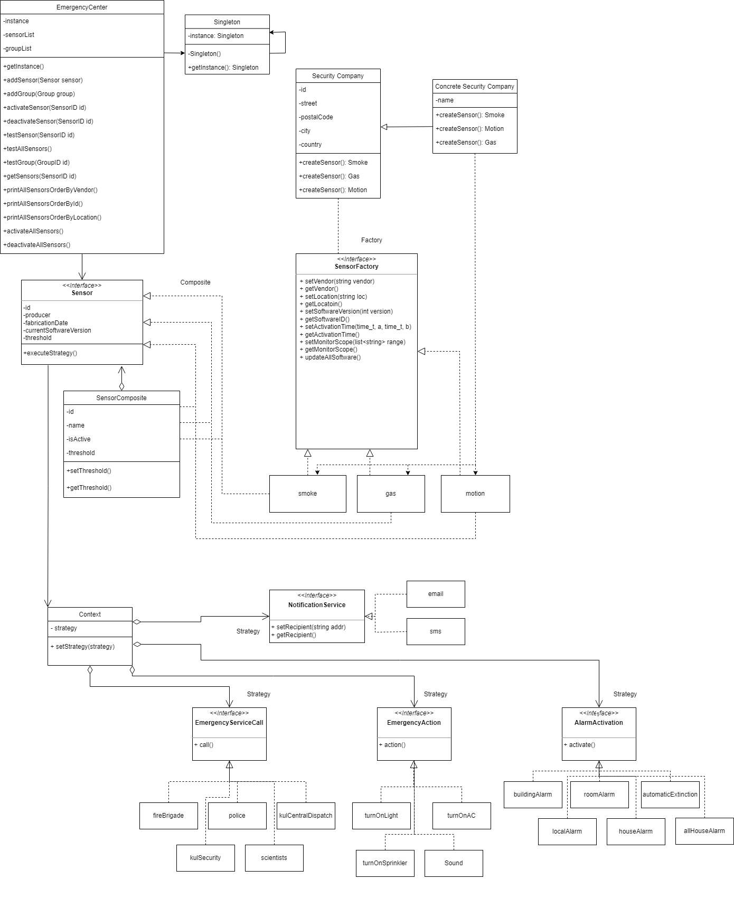

# Topic #
Emergency Center

## Background Introduction ##
* software for an emergency center of flexibility. Types of sensors can beinstalled at the customer’s location, which are all connected to the emergency center. 
* available types: smoke sensors (fire alarm), motion sensors (burglary alarm) and toxic gas sensors (intoxication alarm). 
* releases of new types of sensors andsoftware updates should have minimal interference with other
classes. 
* center should be able to activate/deactivate and test the sensors individually or as a group
* sensor needs to be configurable/addressed individually in its actions (both number and type). * 

## Goals ##
* Design: from requirements to completely detailed class diagram
* Use and correct implementation of “Design Patterns”
* Design decisions about use of const, type of smart pointers, static…
* Implementation of several classes connected via aggregation/inheritance
* Implementation of dynamic binding in C++
* Implementation of interfaces in C++
* Implementation of operator overloading
* Use of functors/lambdas
* Use of git
* Creation of a shareable library
* Implementation of 3 different scenarios based on same “library”

## UML ##
  