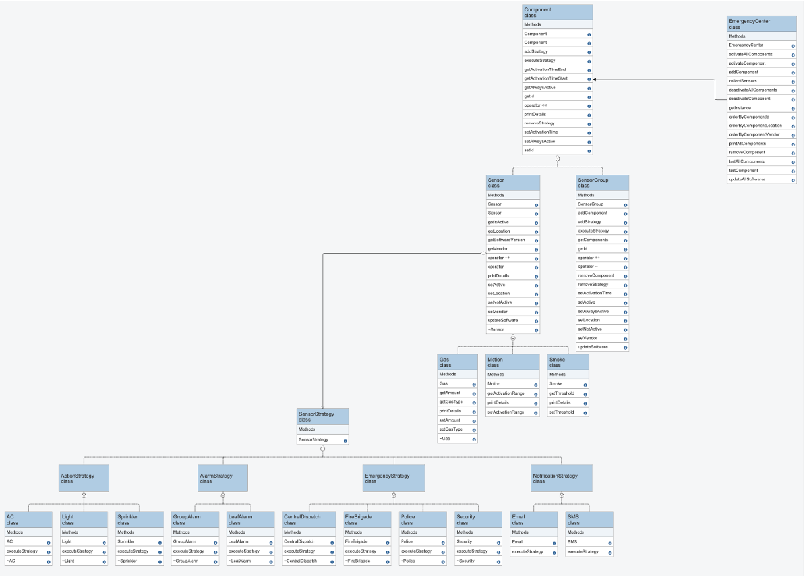

# Topic #
Emergency Center

## Background Introduction ##
* software for an emergency center of flexibility. Types of sensors can beinstalled at the customer’s location, which are all connected to the emergency center. 
* available types: smoke sensors (fire alarm), motion sensors (burglary alarm) and toxic gas sensors (intoxication alarm). 
* releases of new types of sensors andsoftware updates should have minimal interference with other
classes. 
* center should be able to activate/deactivate and test the sensors individually or as a group
* sensor needs to be configurable/addressed individually in its actions (both number and type). * 

## Goals ##
* Design: from requirements to completely detailed class diagram
* Use and correct implementation of “Design Patterns”
* Design decisions about use of const, type of smart pointers, static…
* Implementation of several classes connected via aggregation/inheritance
* Implementation of dynamic binding in C++
* Implementation of interfaces in C++
* Implementation of operator overloading
* Use of functors/lambdas
* Use of git
* Creation of a shareable library
* Implementation of 3 different scenarios based on same “library”

## Achievement ##
* Designed from requirements to comprehensive and structured class diagram.
* Implemented Composite design pattern for relationship between Components where both Sensor and SensorGroup are Classes of Compoenent Abstract Class.
* Implemented Strategy design pattern for relationship between Sensor and SensorStrategy interface. SensorStrategy is the base and interface for all derived abstract Notification, Emergency, Alarm, and Action strategies. The derived abstract strategies have its own concrete class for varied executeStrategy and attributes implementatoins.
* The use of const are imposed to variables that are read only.
* The use of smart pointers are used along with dynamic binding (virtual keyword) that is especially useful for Polymorphism.
* The use of dynamic cast is implemented when Emergency center is interacting with varied Component class types.
* The use of static is seldom implemented in this program.
* Implementation of aggregation/inheritance is exmplified by the heirarchy of Component-Sensor/SensorGroup, and Sensor-Gas/Motion/Smoke, as well as the heirarchy of Strategies.
* Implementation of dynamic binding and interface in C++ is used through out the prorgam
* Implementation of operator overloading is used in both Component and Emergency Center, which includes the Overloading of << Operator for Output Stream, as well as Postfix ++ and -- Operator for activating and deactivating component.
* Use of functors/lambdas is used through out the program and especially EmergencyCenter
* Use of git for structured branches: 
    * * strategy for initial strategies development that is to be adopted by Components
    * * composite for later development that is to adopt strategy and implement the aggregation and inheritance of Component, Sensor, adn Sensorgroup
    * * dev branch includes both strategy and composite to exclude the in progress coding from master branch
    * * main branch for finalized program that is to be published
* Creation of a shareable library is implemented using Makefile that libmylibrary.so is generated.
* Implementation of 3 different scenarios based on same “library”

## Case Summary ##
| Type             | Convention    |
|------------------|---------------|
| Abstract Classes | PascalCase    |
| Concrete Classes | PascalCase    |
| Attributes       | camelCase     |
| Methods          | camelCase     |

## UML ##
  